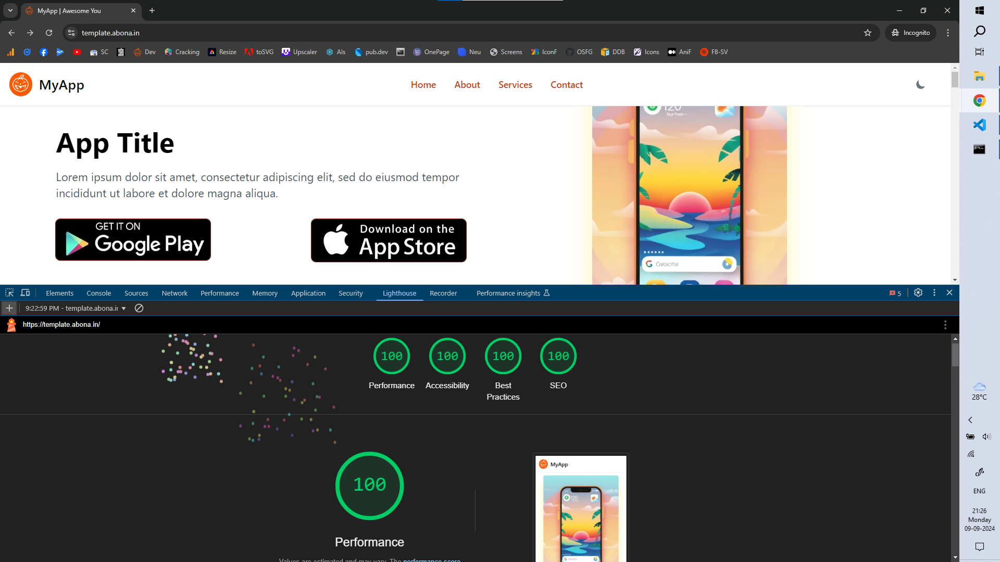

# SvelteKit + TailwindCSS

Svelte and Tailwindcss based one page templates

## Setting up

Install node, npm -> clone the repo -> install dependencies

```bash
cd twtemplates
npm install
```

## Development

Once you've cloned the repo and installed dependencies with `npm install` (or `pnpm install` or `yarn`), start a development server:

```bash
npm run dev
```

## Production

To create a production version of your app:

```bash
npm run build
```

Adapter-Node is already added so you can just run your production version with:

```bash
node build
```

> Preview available at https://template.abona.in


